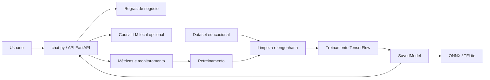
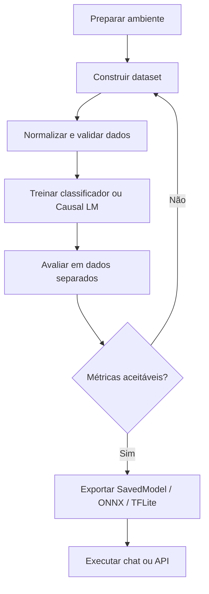
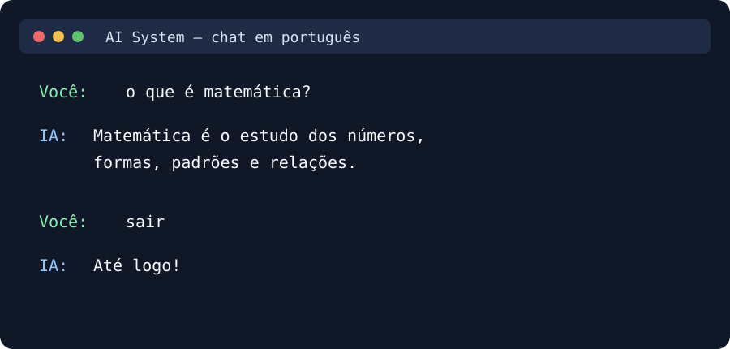
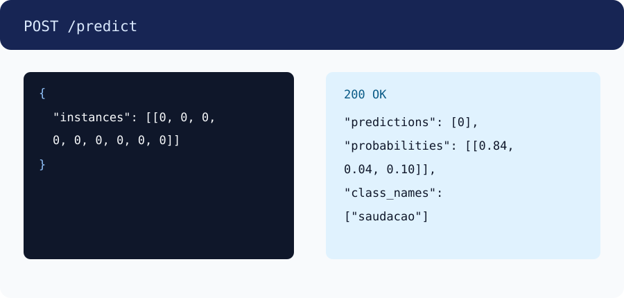

# AI System with TensorFlow

[](https://github.com/BrunoFerreira995/ai/actions/workflows/ci.yml)
[](https://www.python.org/)
[](https://www.tensorflow.org/)
[](https://docs.python.org/3/library/unittest.html)
[](.github/workflows/ci.yml)
[](#licença)

Projeto de estudo e implementação de uma IA com TensorFlow, classificação de
intenções em português e conhecimentos educacionais.

O vocabulário pt-BR usado como recurso lexical está em
`data/pt_br_dictionary/`. Ele contém léxico, verbos e conjugações e foi obtido
do projeto [fserb/pt-br](https://github.com/fserb/pt-br), sob licença MIT.

## Começar

```bash
./install.sh
./train.sh
./run.py       # roda uma previsão do modelo
./chat.py      # inicia o chat em português
./chat_lm.py   # inicia o chat com o Causal LM treinado
./benchmark.sh  # gera o relatório de benchmarks
```

Para treinar e avaliar o Causal LM próprio:

```bash
.venv/bin/python -m phase22_language_model.train_qa \
  --data data/qa_train.jsonl \
  --output-dir artifacts/language_model

.venv/bin/python -m pip install lm-eval
.venv/bin/python -m phase22_language_model.run_lm_eval \
  --model-dir artifacts/language_model \
  --tasks mmlu,gpqa,aime24,bbh
```

O treinamento acima usa o dataset de demonstração com 7 classes educacionais
e cria os arquivos em
`artifacts/`. Não use `--data` sem ter criado um arquivo `.npz`.

## Visão geral da arquitetura



O classificador (`artifacts/saved_model`) responde com classe e probabilidades.
O Causal LM (`artifacts/language_model`) é o componente experimental para
geração de texto em português.

## Fluxo de treinamento



## Chat e API

Prévia do chat:



Prévia da API:



Inicie o chat:

```bash
./chat.py
```

Inicie a API:

```bash
MODEL_PATH=artifacts/saved_model \
.venv/bin/uvicorn backend.app:app --reload
```

Verifique o serviço:

```bash
curl http://127.0.0.1:8000/health
```

Faça uma previsão. O modelo atual espera 8 valores por instância:

```bash
curl -X POST http://127.0.0.1:8000/predict \
  -H 'Content-Type: application/json' \
  -H 'X-Client-ID: exemplo-local' \
  -d '{"instances": [[0, 0, 0, 0, 0, 0, 0, 0]]}'
```

Resposta esperada:

```json
{
  "predictions": [0],
  "probabilities": [[0.84, 0.04, 0.10]],
  "class_names": ["saudacao"]
}
```

Veja todos os endpoints em [docs/API.md](docs/API.md).

## Desempenho registrado

Os valores abaixo são do artefato local atual e não substituem uma avaliação
independente com um conjunto de teste separado:

| Métrica | Resultado |
| --- | ---: |
| Accuracy | 1.0000 |
| F1 macro | 1.0000 |
| ROC-AUC OVR | 0.9867 |
| Log loss | 1.2940 |
| ECE | 0.7177 |
| Dispositivo registrado | CPU |

Atualize a tabela após executar:

```bash
.venv/bin/python -m phase21_classifier_evaluation.evaluate_model \
  --data data/dataset.npz
```

## Comparação dos formatos

| Formato | Uso recomendado | Vantagens | Limitações |
| --- | --- | --- | --- |
| SavedModel | API e TensorFlow | Preserva o ecossistema TensorFlow e assinaturas | Maior dependência/runtime |
| ONNX | Interoperabilidade | Execução em runtimes variados | Algumas operações podem exigir adaptação |
| TFLite | Edge, mobile e IoT | Arquivo menor e runtime leve | Operações e precisão podem ser limitadas |

Os artefatos exportados ficam em `artifacts/`. O Causal LM possui um fluxo
separado e usa `artifacts/language_model`.

## Roadmap

- [x] Classificação de intenções e regras de negócio em português
- [x] Conhecimentos educacionais e vocabulário lexical
- [x] Exportação SavedModel, ONNX e TFLite
- [x] API FastAPI, segurança básica e monitoramento
- [x] Arquitetura inicial de Causal LM próprio
- [ ] Melhorar coerência e coesão do Causal LM com corpus curado
- [ ] Avaliação independente com datasets educacionais separados
- [ ] Otimização de latência e memória no edge
- [ ] Versionamento e registro de modelos em produção

## Licença

A licença deste projeto ainda precisa ser definida pelo mantenedor. O
dicionário pt-BR em `data/pt_br_dictionary` é um recurso separado sob MIT;
consulte a licença original antes de redistribuí-lo.

## Ativar o ambiente Python

Depois da instalação, ative a `.venv` com:

```bash
source .venv/bin/activate
```

Para sair do ambiente:

```bash
deactivate
```

## Scripts

| Script | Função |
| --- | --- |
| `install.sh` | Cria o ambiente virtual Python 3.11 e instala dependências |
| `train.sh` | Treina o classificador e exporta o modelo |
| `run.py` | Executa uma previsão |
| `chat.py` | Abre o chat educacional em português |
| `chat_lm.py` | Abre o chat usando `artifacts/language_model` |
| `benchmark.sh` | Gera o relatório usando o modelo treinado |
| `phase21_classifier_evaluation` | Avalia métricas, robustez e desempenho |
| `phase22_language_model/train_qa.py` | Treina o Causal LM com perguntas/respostas |
| `phase22_language_model/run_lm_eval.py` | Executa benchmarks no Causal LM local |

Para ajustar o treinamento:

```bash
./train.sh --epochs 10 --batch-size 32
```

Para executar uma entrada própria:

```bash
./run.py --input data/sample.npy
```

## Dados próprios

O `train.py` espera um arquivo `.npz` com arrays numéricos `x` e `y`:

```python
import numpy as np
np.savez("data/dataset.npz", x=x, y=y)
```

Depois:

```bash
./train.sh --data data/dataset.npz --epochs 10
```

## Chat em português

```bash
./chat.py
```

O chat reconhece intenções, verbos, sinônimos, entidades simples e disciplinas
educacionais. Digite `sair` para encerrar. O chat local usa regras de negócio;
o Causal LM próprio é treinado e executado na seção “Geração de linguagem”.

Não é necessário baixar outro modelo.

## Benchmarks

O runner de benchmarks está em [benchmarks/README.md](benchmarks/README.md).
Ele cobre MMLU, MMLU-Pro, GPQA Diamond, MATH, AIME 2024/2025, BBH,
ZebraLogic, HumanEval+, MBPP+, LiveCodeBench, IFEval, IFBench, SimpleQA,
PopQA, AGI Eval e Safety.

Listar avaliações:

```bash
.venv/bin/python benchmarks/run_benchmarks.py --list
```

Gerar um plano sem executar:

```bash
.venv/bin/python benchmarks/run_benchmarks.py \
  --model NOME_DO_MODELO
```

Executar benchmarks compatíveis:

```bash
./benchmark.sh
```

O script usa somente `artifacts/saved_model`. Como ele é um classificador
numérico com regras de negócio, o relatório marca MMLU, MATH, GPQA e demais
benchmarks de geração de texto como `not_applicable`; nenhum modelo externo é
baixado ou usado.

Para escolher os benchmarks do relatório:

```bash
BENCHMARKS=mmlu,math,ifeval \
./benchmark.sh
```

Os relatórios ficam em `benchmark_results/`.

## Avaliação do classificador

Para avaliar o modelo treinado com as métricas adequadas ao classificador:

```bash
.venv/bin/python -m phase21_classifier_evaluation.evaluate_model
```

O relatório fica em `benchmark_results/classifier/classifier_report.json`.
Para obter métricas válidas, informe um dataset rotulado:

```bash
.venv/bin/python -m phase21_classifier_evaluation.evaluate_model \
  --data data/dataset.npz
```

## Geração de linguagem

A base de um modelo causal próprio está em
[phase22_language_model/README.md](phase22_language_model/README.md). Ela
inclui tokenizer, Transformer decoder-only, RoPE, MQA, KV cache, geração
autoregressiva, beam search e losses opcionais de alinhamento.

Teste a implementação:

```bash
.venv/bin/python -m unittest phase22_language_model.test_phase22
```

Essa arquitetura ainda precisa ser treinada com perguntas e respostas antes
de produzir respostas úteis ou receber pontuação nos benchmarks de LLM.

Treinar o Causal LM próprio:

```bash
.venv/bin/python -m phase20_portuguese_nlp.build_qa_dataset \
  --output data/qa_phase20.jsonl \
  --dictionary-variants 4
.venv/bin/python -m phase20_portuguese_nlp.build_word_explanations \
  --output data/word_explanations.jsonl
.venv/bin/python -m phase22_language_model.train_qa \
  --data data/qa_phase20.jsonl \
  --word-explanations data/word_explanations.jsonl \
  --output-dir artifacts/language_model
```

Executar o adaptador `lm-eval` usando somente esse modelo:

```bash
.venv/bin/python -m pip install lm-eval
.venv/bin/python -m phase22_language_model.run_lm_eval \
  --model-dir artifacts/language_model \
  --tasks mmlu,gpqa,aime24,bbh
```

O relatório será salvo em `benchmark_results/language_model/`.

Depois de treinar o Causal LM, inicie o chat próprio com:

```bash
./chat_lm.py
```

Para usar outro diretório de checkpoint:

```bash
./chat_lm.py --lm-model artifacts/language_model
```

As áreas educacionais incluem Língua Portuguesa, Literatura, Redação,
Matemática, Física, Química, Biologia, História, Geografia, Filosofia,
Sociologia, idiomas, Educação Física, Artes e Itinerários Formativos.

## Testes

```bash
.venv/bin/python -m unittest discover -p 'test_*.py'
```

## Artefatos

O treinamento gera:

```text
artifacts/
├── checkpoints/best.keras
├── business_rules.json
├── classes.json
├── metrics.json
├── model.onnx
├── model.tflite
├── language_model/
└── saved_model/
```

## Backend API

Para iniciar a API FastAPI:

```bash
MODEL_PATH=artifacts/saved_model .venv/bin/uvicorn backend.app:app --reload
```

A documentação fica disponível em <http://127.0.0.1:8000/docs>. As configurações
Docker e Kubernetes estão em [backend/README.md](backend/README.md).

## Cloud

Templates de deploy para AWS, Google Cloud e Azure estão em [cloud/README.md](cloud/README.md).

## Edge AI

O executor TFLite e as instruções para Raspberry Pi, Jetson, Coral TPU,
Android e iOS estão em [edge_ai/README.md](edge_ai/README.md).

## Monitoring

Os utilitários de logging, drift, performance, recursos e alertas estão em
[monitoring/README.md](monitoring/README.md).

## Retraining

O pipeline de validação, retreinamento, versionamento, registro e A/B testing
está em [retraining/README.md](retraining/README.md).

## Security

Os controles de autenticação, autorização, criptografia, rate limiting e
testes adversariais estão em [security/README.md](security/README.md).

## Advanced AI

Os adaptadores de visão computacional, OCR, pose, vídeo, classificação textual
e tradução estão em [phase20_advanced_ai/README.md](phase20_advanced_ai/README.md).

## Documentation

A documentação completa está em [docs/README.md](docs/README.md), incluindo
API, arquitetura, treinamento, deployment e troubleshooting.
