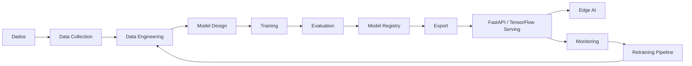

# Arquitetura

## Componentes

- `phase3_data_collection`: coleta e armazenamento
- `phase4_data_engineering`: limpeza e preparação
- `phase6_neural_networks` a `phase9_hyperparameter_optimization`: modelos e treino
- `phase10_evaluation` e `phase11_explainability`: qualidade e explicabilidade
- `phase12_model_compression` e `phase13_export`: otimização e exportação
- `backend`: API de inferência
- `monitoring`, `retraining` e `security`: operação em produção
